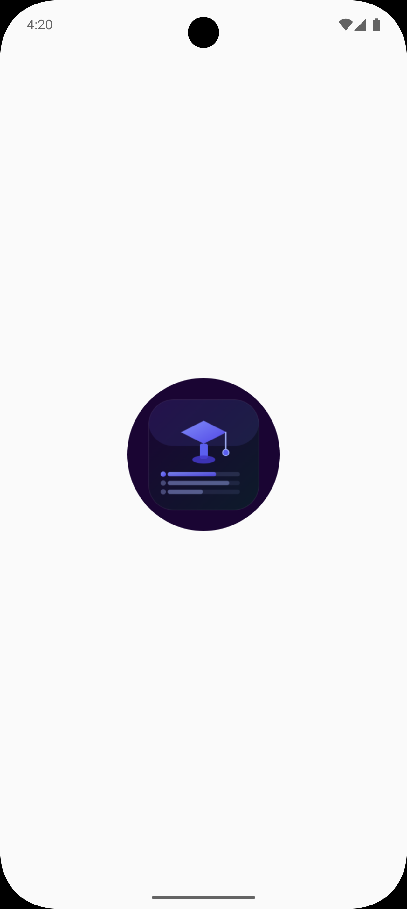
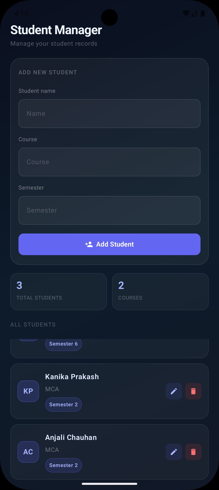

# 🎓 Student Manager App

A modern Android application built using **Kotlin**, **Jetpack Compose**, **Room Database**, and **MVVM Architecture**. The app helps users manage student records with full CRUD (Create, Read, Update, Delete) functionality while storing data locally using Room Database.

---

## ✨ Features

* ➕ Add New Students
* 📋 View All Students
* ✏️ Edit Student Information
* 🗑️ Delete Students
* 💾 Local Data Persistence with Room Database
* 🏗️ MVVM Architecture
* 📦 Repository Pattern
* ⚡ Automatic UI Updates
* 🎨 Modern Jetpack Compose UI

---

## 🛠 Tech Stack

* Kotlin
* Jetpack Compose
* Material 3
* Room Database
* MVVM Architecture
* Repository Pattern
* Coroutines
* ViewModel
* State Management

---

## 📂 Project Structure

```text
com.chotu.studentmanager

├── data
│   ├── dao
│   ├── database
│   └── entity
│
├── repository
│
├── viewmodel
│
└── ui
```

---

## 🗄️ Database Structure

### StudentEntity

```kotlin
StudentEntity(
    id: Int,
    name: String,
    course: String,
    semester: Int
)
```

### StudentDao

* Insert Student
* Delete Student
* Update Student
* Get All Students

### StudentDatabase

Room Database configuration.

### DatabaseProvider

Provides a single database instance across the application.

---

## 🔥 CRUD Operations

### Create

Add new student records.

### Read

Display all students stored in the database.

### Update

Edit existing student information.

### Delete

Remove students from the database.

---

## 🧠 What I Learned

* Room Database Integration
* MVVM Architecture
* Repository Pattern
* ViewModel & ViewModel Factory
* State Management in Compose
* Coroutines
* CRUD Operations
* Data Persistence
* Modern Android Development

---

## 🚀 Installation

### Clone Repository

```bash
git clone https://github.com/IronMan0208/Student-Manager.git
```

### Open Project

Open the project in Android Studio.

### Run Application

Build and run on an Emulator or Physical Device.

---

## 📸 Screenshots

### 🌟 Splash Screen

<p align="center">
  
</p>

### 🏠 Main Screen

<p align="center">
  
</p>


---

## 🔮 Future Improvements

* 🔍 Search Students
* 📊 Student Statistics
* 🌙 Dark Mode
* 🏷️ Course Filters
* 📅 Admission Date
* ☁️ Cloud Sync with Firebase

---

## 👨‍💻 Author

**Ajay Kumar**

Android Developer passionate about building modern Android applications using Kotlin, Jetpack Compose, Room Database, MVVM Architecture, and Clean Code principles.

GitHub: https://github.com/IronMan0208

---

## ⭐ Support

If you found this project useful, consider giving it a ⭐ on GitHub.
